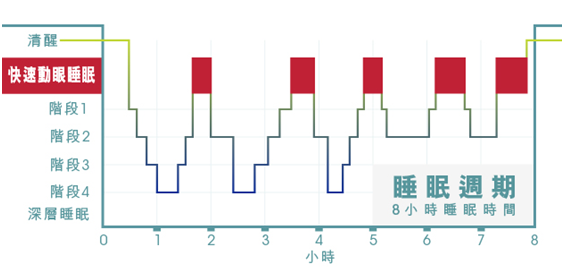

# 睡眠講座
今天學校安排了[***哇賽心理學***](https://podcasts.apple.com/tw/podcast/%E5%93%87%E8%B3%BD%E5%BF%83%E7%90%86%E5%AD%B8/id1500162537)的心理學教授來講解睡眠的相關知識以及加強睡眠品質的方法。這裡整理了一些他的講座的筆記，供以後參考。

# 睡眠

睡眠不是持續的沈睡  
也不是越來越淺或越來越深的過程  
反而是種週期性的深度  
分為安穩期與快速動眼期，越接近起床的睡眠快速動眼期越長，睡得越不安穩  

換句話說  
整個八小時睡眠，最深度睡眠發生在第一個小時

# 良好的睡眠
最良好的睡眠品質由三要素組成  
分別是：
* 規律作息
* 充足睡眠
* 睡前放鬆

其中最重要的就是***規律作息***  
要讓身體習慣清醒的時間與睡覺的時間  
最可行的方法就是早上好好接觸陽光  
陽光在的時候多運動  
而晚上或睡前就讓附近暗一點  
  
第二個最重要的就是***睡前放鬆***  
所謂的睡前放送絕對不是滑手機或使用3C  
而是盡量減少光源  
做一些不用動腦的事情  
做完全不花腦力的事情
像是聽音樂、發呆、打坐之類的  
  
最後一點才是充足睡眠  
  
*統整以上良好睡眠的要素*
可以總結出這些要點  
* 白天不要補眠(最多十到二十分鐘)(因為補眠會讓身體擾亂睡眠時間跟清醒時間) 
* 上床時間穩定
* 白天30分鐘以上陽光
* 白天要有充足活動
* 晚上不要用螢幕
* 睡前不用手機
* 週末不能破壞生理時鐘(可以睡久一點，最多兩小時，但還是要保持上述要點)

# 失眠
因為時間的關係講師沒有講到太多的失眠知識  
但還是可以整理一點點筆記  
當遇到失眠睡不著的狀況，在床上翻來覆去時  
若超過二十分鐘  
就馬上離開床鋪  
***中斷焦慮狀態***  
開個小燈  
做一些***睡前放鬆***的事  

# 心得
這可以完全結合原子習慣所學  
打造一個***健康的人生***
我是一個***健康的人***  
  
這次學校舉辦的講座是我有史以來覺得最有用且重要的講座  
真的學到非常多有關睡眠的知識  
而且都是跟常識相反的  

<!-- truncate -->   

