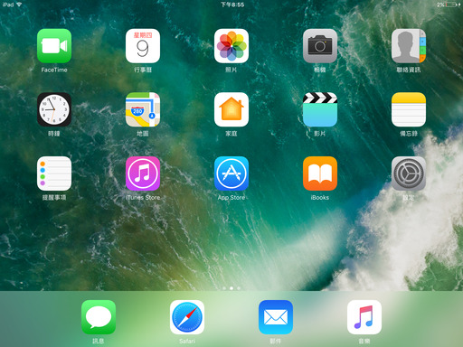
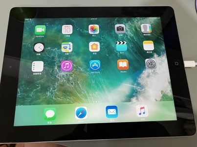
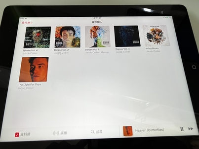
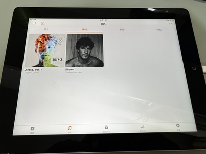
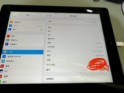

# iPad 4
今天把幼稚園時的iPad 4 重新拿出來  
想把他救活重新使用  
沒想到還蠻簡單的  
插上電腦後  
重新灌系統  
就結束了  

## ios 10.3.3
這是這台iPad 4能跑的最新的系統了  
iPad 4 在2012年發表，擁有16gb的硬碟(不是記憶體喔)和1gb的記憶體  
在2025年只能做簡單的上網、聽音樂  
像我在打這篇的同時就把這台iPad當作音樂播放器使用  
令我驚訝的是竟然還可以使用Apple Music線上串流服務誒  
所以我現在同時使用VLC 和 Apple Music  來聽音樂  
這台iPad 4就成為我專門聽音樂的裝置了  
   
這台iPad最麻煩的就是版本  
幾乎沒有能用的軟體  
想找一個RSS Reader都很難  
但也還好  
用網頁版就好  
  
ios 7~ios 10是我覺得最好看的時期  
控制中心是更漂亮的白色  
但現在Liquid Glass也不錯啦  
算是從ios7後最大的一次改款了  

## 照片集
  
  
  
  
  
