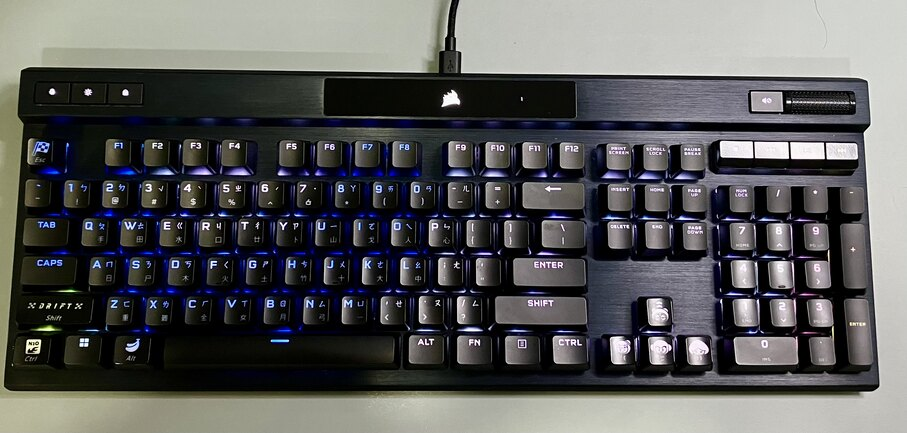
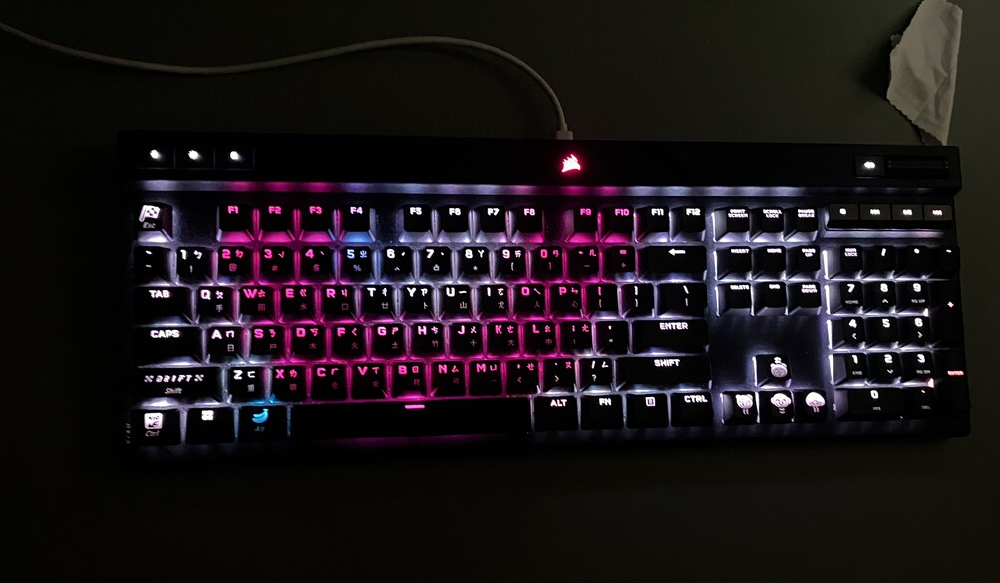

# 我的鍵盤Pt. 1
介紹我的鍵盤的第一張  
前兩天沒更新抱歉了  
因為我在享受我的鍵盤  
首先是第一把鍵盤  
### ***K70 RGB PRO 銀軸***  
這是我所有鍵盤中最喜歡的一把  
大概在2023年中購入  
首先  
他是跑跑玩家必備的K70系列鍵盤  
K70從以前到現在出過很多個版本  
這版大概是在2019左右出的  
其他的還右K70 RGB, K70 mk2 se, K100, K70 lux, K70 Max  
我最後選擇的是這把K70 RGB PRO  
因為當時他特價  
他最厲害的地方就是用它來玩跑跑，跑起來都特別快  
不知道為什麼  
成績就是比其他鍵盤快半秒以上  
應該是因為他支援海盜船的Axon加速技術  
可以以8000hz的頻率與電腦溝通  
大大增加反應速度  
人體感受不到差距的零點幾幾秒  
但可以很輕鬆地感受到車子變輕，變靈敏  
  
買這把鍵盤得時候正職鯊魚氣墊船時期，跑跑飄移巔峰期  
雖然當時實力太弱，感受不太到這把鍵盤的威力  
但還是跑得非常爽  
但就在今天   
跑跑飄移關服後  
我在國服跑跑一刷刀劍雲中峽谷  
這把鍵盤真的帶給我非常好的體驗  
這是我其他磁軸紅軸鍵盤都跑不到的  
這幾分鐘前成功跑到了1:35:81  

最後是他的打字手感  
雖然這部分應該是跑跑玩家最不在乎的部分  
但也是對我來說很重要的部分  
銀軸的超短鍵程(1.2mm)跟超輕的手感讓我很舒適  
但聲音就普普通通這樣  
  
p.s.其中幾個帥氣的跑跑系列鍵帽是做影片做來的，這個以後有機會再說了  
  
  
