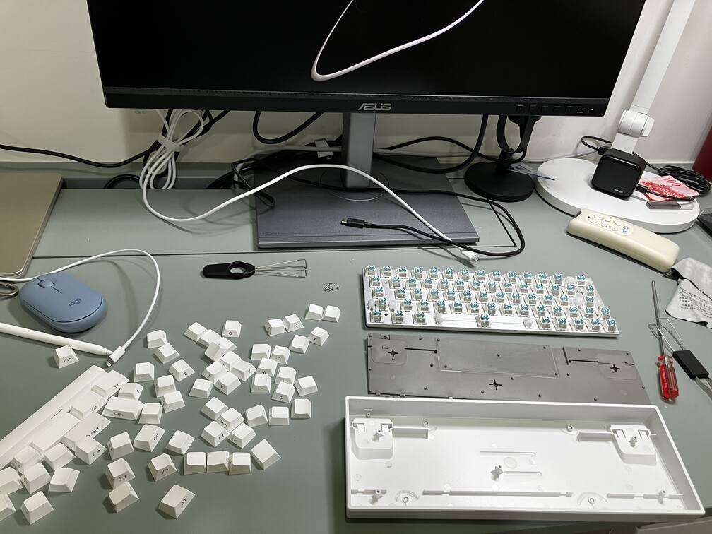
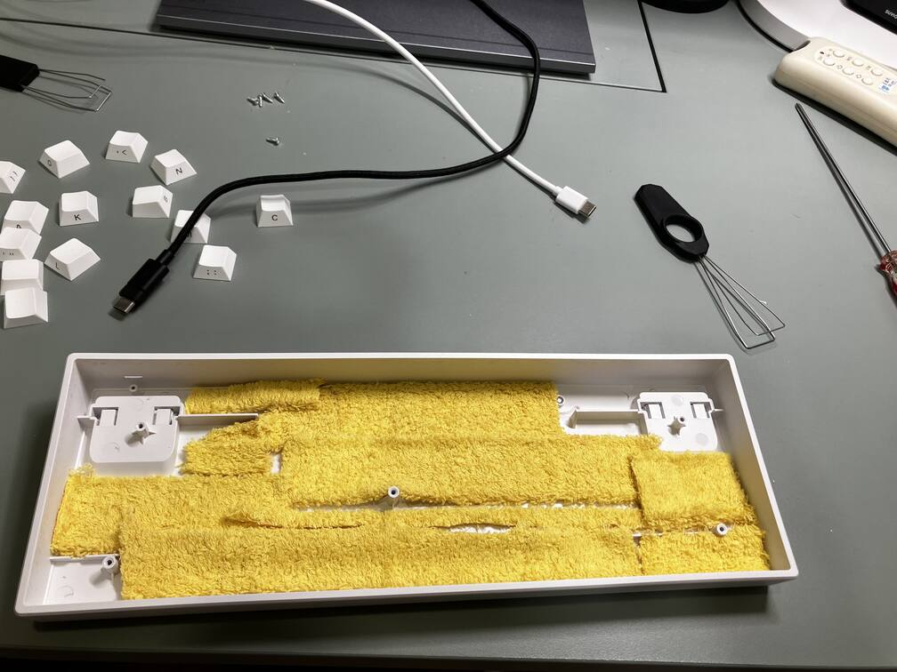
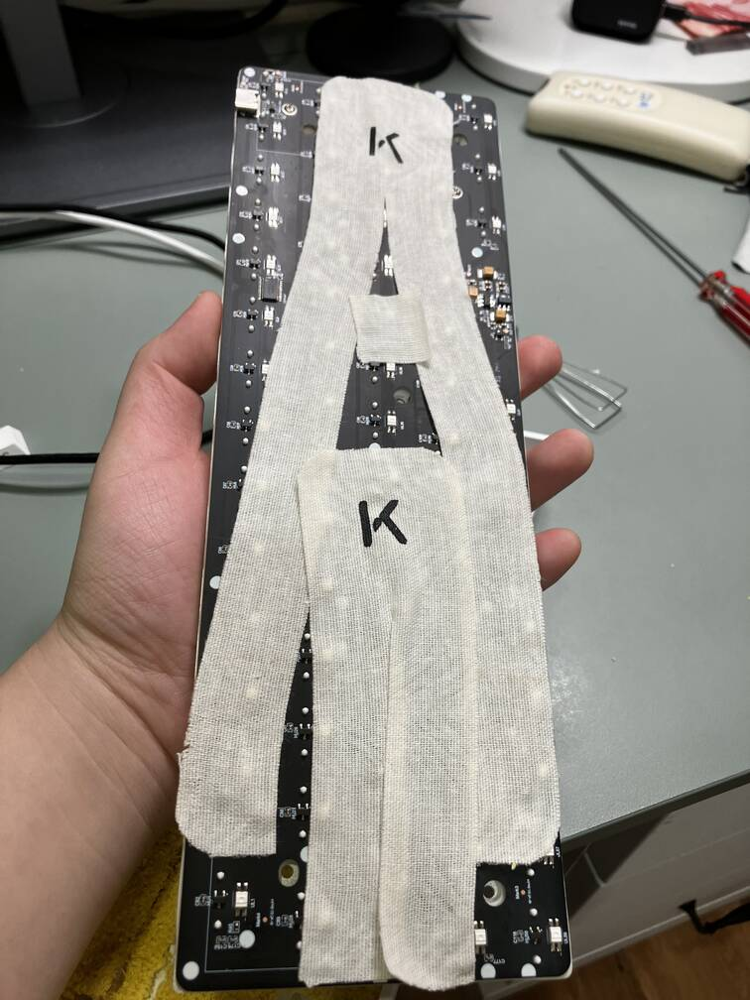

# 鍵盤變聲and我的鍵盤Pt. 2
最近開始研究鍵盤  
看了一些Blog文章和youtube頻道  
像是[Kalan的Blog文章](https://blog.kalan.dev/devnote/keyboard-1)和[Hipyotech的Youtube頻道](https://www.youtube.com/@HipyoTech)  
看到他們對客製化鍵盤的講解  
害我也對這方面有點心動  
今天決定著手自己試試看  

## Irok ND 63 Pro 
這是一把今年六月買的鍵盤  
因為桌面空間不足，想買一把65%～70%的鍵盤  
加上最近(對我來說)鍵盤圈磁軸的崛起  
害我也對磁軸有些興趣  
我同學就那麼剛好有一把不需要的磁軸的65%鍵盤  
性能非常好(0.02mm~4.00mm鍵程控制)  
就跟他用大概75%價錢(750)買下來了  
當下使用的時真的覺得控車又更加靈敏了  
但大概使用一兩個月後又回到使用K70的銀軸了  
發現太靈敏也不太好  
跑起來速度也沒有那麼快  
就換回去了K70  
  
放著大概一個月後  
突然看到上面[Kalan的Blog文章](https://blog.kalan.dev/devnote/keyboard-1)和[Hipyotech的Youtube頻道](https://www.youtube.com/@HipyoTech)  
決定自己開始客製化鍵盤  

## 開始客製化  
這把鍵盤在沒有玩跑跑的功能後  
就變成一個純打字用的鍵盤了  
那麼聲音就非常重要了  
原本他因為使用ABS鍵帽+無段落的磁軸  
聲音真的是非常ㄅㄧㄚㄅㄧㄚㄅㄧㄚ

一開始我先在沒有任何輔助的情況下，把整把鍵盤拆掉  
看看他到底長什麼樣子  
   
了解他的構造後開始查詢如何讓鍵盤聲音變Thocky  
找到了相關的文章和影片，就自己開始動工  
影片說可以加一層膠帶、絨布等等的在鍵盤殼中  
家裡我就突然想到可以用幾年前打羽毛球剩下的握把布   
那種最厚的黃色像毛巾一樣的那種  
撕開後面的雙面膠整齊地貼在殼上  
  
這樣就有很好的效果了  
  
後來看到Hipyo Tech提到可以貼一層膠帶在PCB上  
我就找了很久以前的運動酸痛貼布  
貼了上去  
  

最後全部組裝上去  
就完成了  

## 聲音對比  
改裝之前  
<audio controls> <source src={require('./keyboard2.m4a').default} type="audio/mp4" /> </audio>  
改裝之後 
<audio controls> <source src={require('./keyboard1.m4a').default} type="audio/mp4" /> </audio>   
應該很明顯聽得出來前後差距吧  
太開心了  
