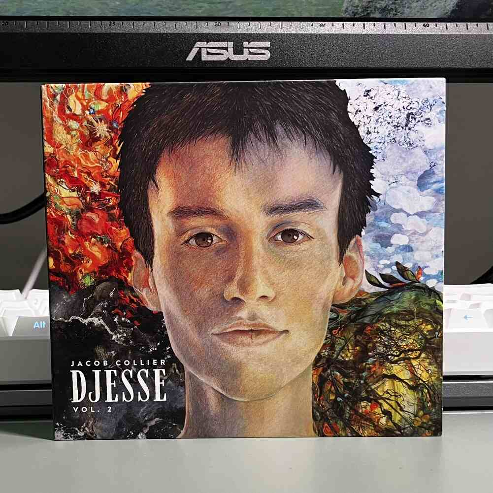
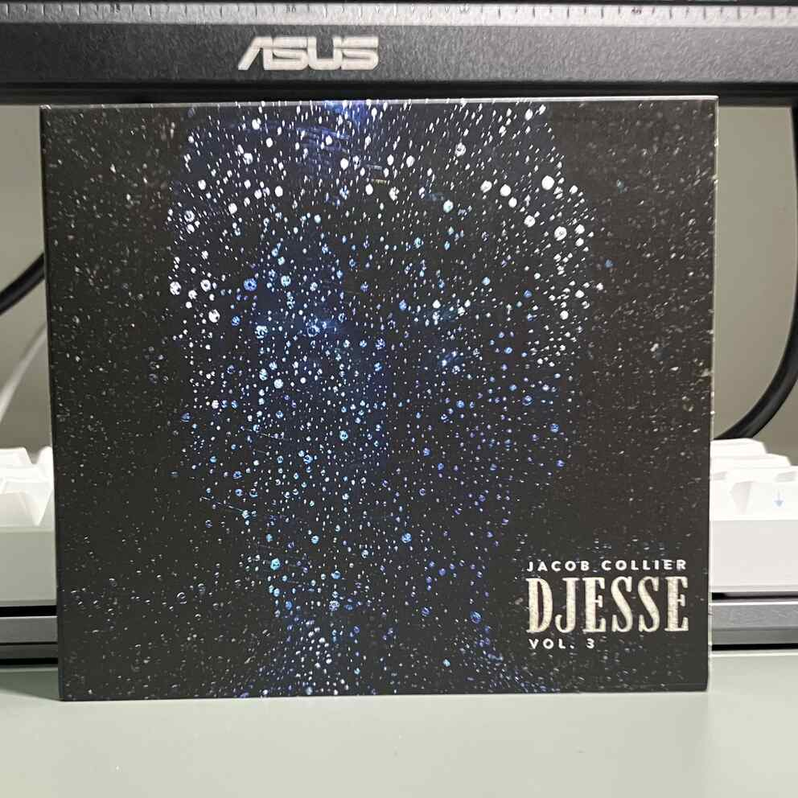
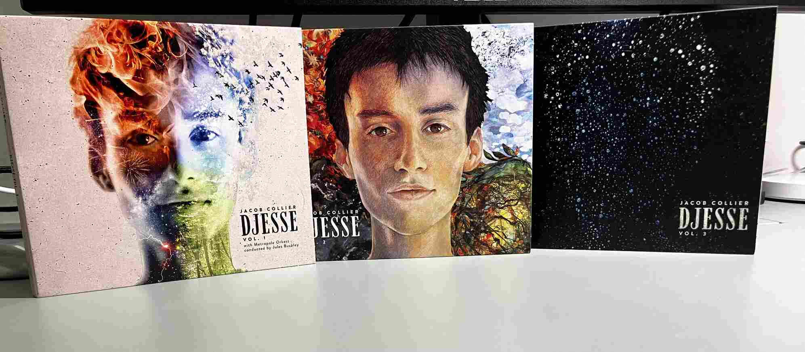

# 新CDs
今天新訂的CD到了  
是Djesse Vol. 2 和 3    
漂亮吧  
  
  
這是三個集結再一起的樣子  
  
快要全部搜集完了  
## 播放器  
使用這些檔案很爽  
但是要在手機端挑選播放器很不容易  
最簡單的就是使用VLC  
但是他不會記錄我聽了哪些歌多久哪些歌手  
有點可惜  
所以我就用Apple Music了  
有些比較沒關注的人可能不知道  
其實Apple Music從以前到現在的app名稱都叫做***音樂(Music)***   
最早設計出來是為了在iPod播放真正的無DRM從iTunes買下來了AAC檔案  
但從庫克上去後就改成一個訂閱制串流平台了  
非常可惜  
  
就是因為現在變成一個串流平台了  
要把檔案傳到手機上用這個播放器播放  
非常的麻煩  
需要使用三十年前的方式  
有線連接到一台Mac  
到finder找到sync頁面  
然後發現要關掉「同步資料庫」才可以sync  
關掉後用線慢慢慢慢傳輸  
傳完後  
在重新打開同步資料庫找回以前聽的音樂  
超先進  
