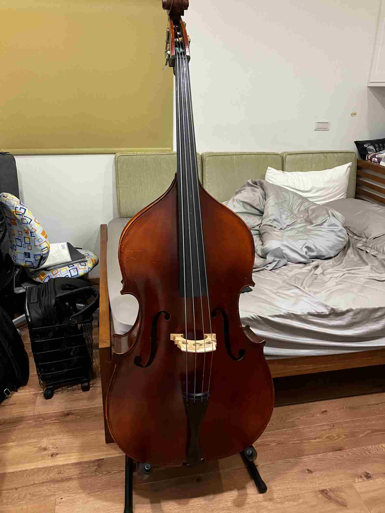

# Double Bass 來了
今天去領了double bass，我想要租的是3/4的，但他還沒整理好，所以先借了我一把1/2的。1/2真的太小了，好奇怪。我滿心期待地打開我的課程，上完前兩集學會了如何平衡我的琴後，發現靠杯，為什麼這把琴的弦不是從粗到細。超扯的，照理來說，弦的粗細要跟音高一樣，越高的音越細，但這把琴G音的弦比D音的粗！超誇張！我就決定不要再動它了，等3/4整理好再重新開始學，平衡再重新抓。雖然很弦的粗細有問題，尺寸也不是標準的，但我還是拍了一張照片，還是非常帥氣的。    
   
## 一週一個音樂作品計劃
這週是真的錄不出來了，我下週再跟Beat Yourself Up一起上傳。這樣算失敗嗎，應該算是，但我還是會繼續進行，因為這週我的吉他手感恢復了很多，細節做得比我小時候好很多，應該也算是某種層面的進步吧。下星期三我會一次上傳Silk Hat跟Beat Yourself Up，不管完成度多少，都一定要上傳。     
    
當初真的是太小看Silk Hat這首曲子的難度了，我以為他會很簡單，結過他是目前我練過的曲子最難的，音樂很弦的轉換非常快，速度很快，而且又是些不符合我的手型的和弦。比起之前練的點弦Monologue或最喜歡的輕鬆愉悅的One或是下午三點四十分都還難。    
