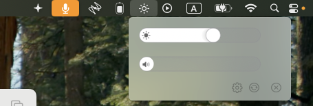
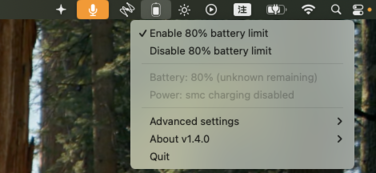
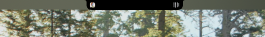
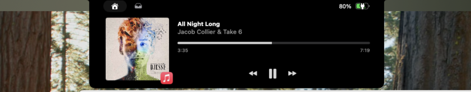
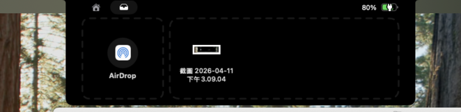
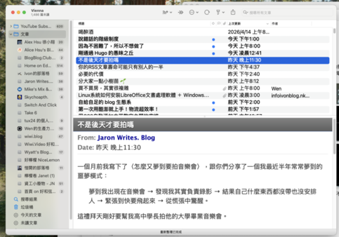
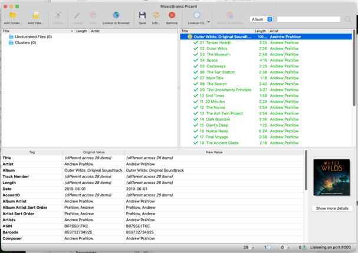
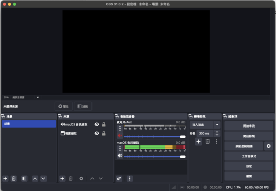

# 好用軟體
這篇文來整理我在macOS中用的好用軟體，這些軟體必須有以下條件     
1. 是開源的自由軟體      
2. 好用     
沒錯就這兩個，單純想分享一下有些好用的東西       
## [MonitorControl](https://github.com/MonitorControl/MonitorControl)
這是一個讓軟體控制螢幕參數的東西，一般來說macOS要控制外接螢幕音量大小、亮度需要手動去按螢幕上的實體按鈕，用這個就可以用鍵盤或滑鼠直接調。安裝後他會在上面的menu bar顯示一個小小的icon，點進去就可調整外接螢幕亮度跟音量。我通常是使用鍵盤快速鍵F1 F2控制亮度，F10 F11 F12控制靜音、條小音量、條大音量。       
   
## [Battery](https://github.com/actuallymentor/battery)    
這是一個控制筆電充電量的軟體，可以控制充電到多少％就停止，也就是跟macOS26.4的新功能一模一樣的東西，絕對不要為了控制電量安裝新作業系統啊。     
   
## [Boring Notch](https://github.com/TheBoredTeam/boring.notch)
MacBook上面都有一個醜醜的瀏海，這是讓那個醜醜瀏海變成動態島的軟體，幾乎沒有實質幫助，就是很帥很酷這樣。這個我最近才開始用，所以對他得耗電量還不了解，但總之很帥，然後可以很快Airdrop這樣。    
    
   
    
他的設定有很多詳細的參數可以調，這邊就不多寫，因為我也還不知道怎麼設定好。     
## [IINA](https://github.com/iina/iina)
播放器，這個應該沒有人不知道，反正很厲害，就這樣。
## [Vienna](https://github.com/ViennaRSS/vienna-rss)
一個很好用的RSS閱讀器，就這樣。    
    
## [MusicBrainz Picard](https://github.com/metabrainz/picard)  
一個幫音樂貼上標籤的軟體，對於買CD的人來說非常重要。他可以把CD中的每首歌貼上他的所有資訊，誰唱的誰寫的哪一年等等等等等等，非常好用。
    
## [OBS](https://github.com/obsproject/obs-studio)   
應該也沒有人不知道，好用的串流錄影軟體。    
   
## 終端機
當然還有很多終端機中的軟體，像是    
* ffmpeg(音頻處理軟體)       
* ghostscript(壓縮pdf軟體)     
* imagemagick(壓縮圖片軟體)    
* yt-dlp(下載YouTube影片)      
還有很多，我就不依依列出來了    
