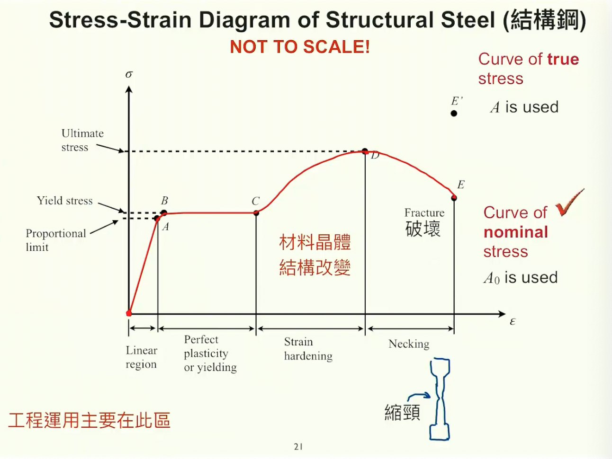
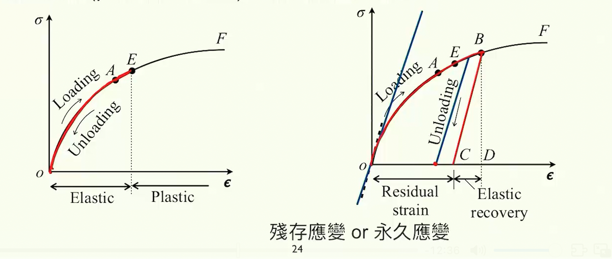
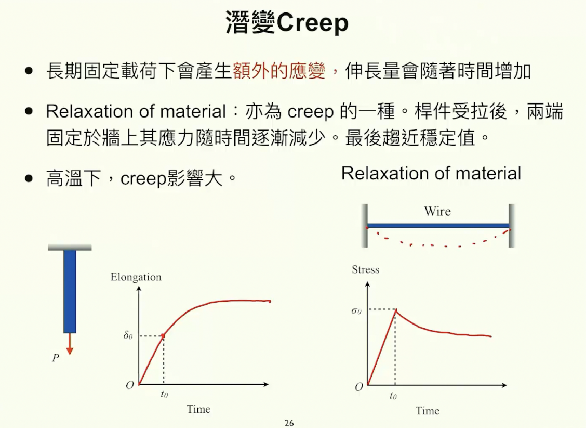

# 材料力學Day 2
今天是第二天，有感覺內容變難了些   
但是還在可控範圍內   
兩天總共花了三小時    
我覺得ＯＫ了    
該開始學html和javascript來圖形化了  
昨天的東西有很多瑕疵但我也懶得管了   
在網站上看起來很怪但我本地看還不錯    
之後要大翻新網站再說   

## 第二課筆記
 銅棒的應力應變曲線圖     
   
### 延展性和脆性
  1. 延展性：變形可以很大量，破壞之前會產生很大的永久應變。eg.結構鋼
  2. 脆性材料：變形很小，超過彈性極限就斷掉 。    
### Percent elongation Percent reduction   
伸長率：$\frac{L_1-L_0}{L_0}$     
截面積縮小率：$\frac{A_0-A_1}{A_0}$      
**若沒有明顯Yield point**：就把linear區域的線往右移0.002，沒有為什麼，是經驗   
**受壓和受拉曲線不同**  
### Loading and Unloading加載與卸載
把力放上去和把力拿掉    
* 從**原來加載曲線**回到原點，稱為彈性   
哪裡是彈性區間，在能回到原點的曲線範圍內叫做**彈性區間 Elastic**
**線彈性**：彈性區間是斜直線Linear     
* 超過彈性區間後進入**塑性 Plastic**    
在超過彈性區間後會怎麼unloading呢？    
 會沿著**初始斜率**回來(Stress and strain curve在x=0的微分)    
 這種超過彈性區間的unload應變叫做**殘文應變**或**永久應變**(Residual Strain)    
 因為他回不去了   
 發生明顯改變
 展現**Plasticity**行為
 如果又在load，就會沿著初始斜率回去然後接回原本的curve，彈性極限會被往前推一點點到Ｂ，但**塑性區域減小**，因為永久應變已經在那裡了回不去了，多的只剩E到B          
    
### 潛變Creep   
長時間固定載荷下會產生**額外的應變**，伸長量會隨時間增加      
好像就是潛在的變化的感覺     
一開始會幾乎線性伸長，然後隨著時間推進達到極限。叫做**潛變**     
繃緊的材料，一開始應力線性上長，在長時間後鬆掉，應力減少。也叫做潛變。     
    
### 虎克定律 Hooke's Law
Linear elasticity(線彈性)：應力應變曲線為線彈性且線性，符合虎克定律。    
$\sigma=E\epsilon$    
E是彈性模數modulus of elasticity或楊氏模數(單位：N/$m^2$, Pa)     
在線Linear彈性範圍難，不是Linear的都不行    
## Poisson's Ratio
Def : 桿件受到拉利伸長時，橫向收縮。此橫向變化過程就是Poisson's Ratio
# $\nu=-\frac{lateral\,strain}{axial\,strain}=-\frac{\delta'}{\delta}$  
通常在0.25在0.35之間      
理論最大值為0.5   
## 最後強調
1. Linear elastic線彈性       
2. homogeneous均值             
3. isotropic等相性    
  
